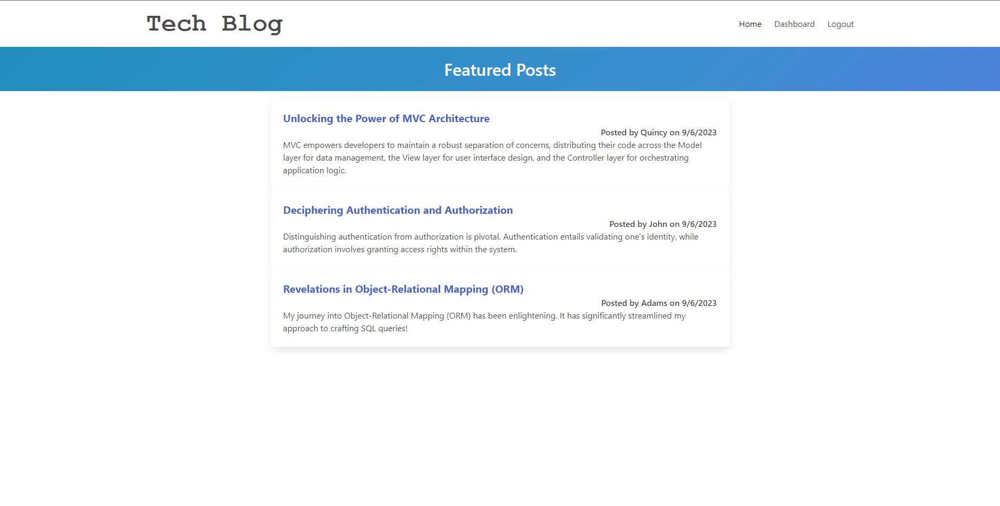

# MVC Tech Block

## Description
MVC Tech Block is a web application designed to showcase the Model-View-Controller (MVC) architectural pattern in a tech-related context. This application demonstrates the separation of concerns by dividing code into models, views, and controllers, making it easier to develop and maintain web applications.

## Table of Contents:
- [Overview](#Overview)
- [Features](#Features)
- [Usage](#Usage)
- [Installation](#Installation)
- [Technologies](#Technologies)
- [What I Learned](#What-I-Learned)
- [Future Enhancements](#Future-Enhancements)
- [License](#License)
- [Author](#Author)

## Overview
The MVC Tech Block application provides a clear example of how to structure a web application using the MVC pattern. It includes features like user authentication, CRUD operations on tech-related items, and a clean, organized codebase.

## Features
- User registration and authentication.
- Create, read, update, and delete (CRUD) operations for tech-related items.
- Separation of concerns through MVC architecture.
- Responsive and user-friendly interface.

## Usage
1. Clone the repository.
2. Install dependencies using `npm install`.
3. Set up your database and update the configuration in `.env` file.
4. Run the application using `npm start`.
5. Access the application in your web browser at `http://localhost:3000`.

## Installation
To install and run this application locally, follow these steps:

1. Clone the repository: 
   git clone https://github.com/AlanPaccor/mvc-tech-block.git
   
cd mvc-tech-block

npm install

Set up your database:

Create a MySQL database.
Update the database configuration in the .env file.

npm start

Access the application in your web browser at http://localhost:3001.

Technologies
Node.js
Express.js
MySQL
Sequelize
Handlebars (View Engine)
Passport.js (Authentication)
Bootstrap (Styling)
MVC Architecture
What I Learned
Through building MVC Tech Block, I gained valuable experience in:

Implementing the MVC architectural pattern in a web application.
Integrating user authentication using Passport.js.
Performing CRUD operations with Sequelize and MySQL.
Creating a responsive and user-friendly interface with Bootstrap.
Structuring a clean and maintainable codebase.
Future Enhancements
In the future, I plan to enhance MVC Tech Block by adding additional features, such as:

User profile management.
Search and filtering functionality.
Integration with external APIs for tech-related data.
Real-time updates using WebSocket technology.
License
This project is licensed under the MIT License - see the LICENSE file for details.

Author
Alan